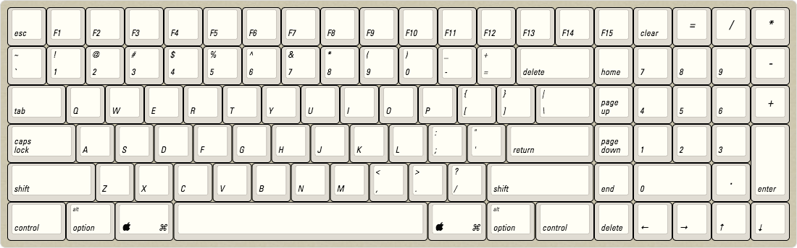

# apple-compackt
A compact keyboard built from an Apple Extended Keyboard II

This is an AEK II modification project, but it'll work with and ALPS or Cherry MX
(and compatible switches).  It's 103 keys but without gaps.

I'm still working out the ALPS stabilizer dimensions.  I'll add options for an acrylic top frame later. My
initial plan is to build as a sandwich board, and mount keys in floating style.

For Cherry / Costar stabilizers, there'll be an alternative plate layout.

### What's next

Plate layouts, frame and base plate.

http://www.keyboard-layout-editor.com/#/gists/3fb4ad30fa3d29fc6964

